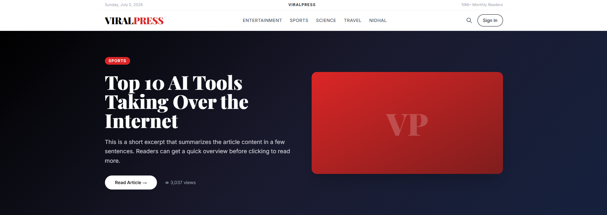
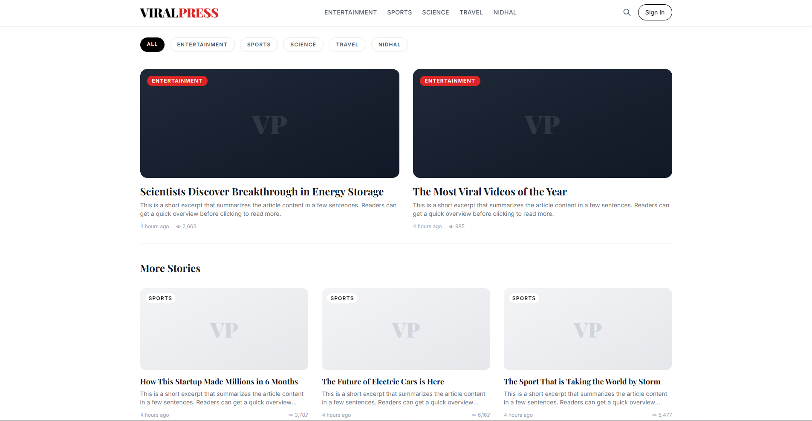
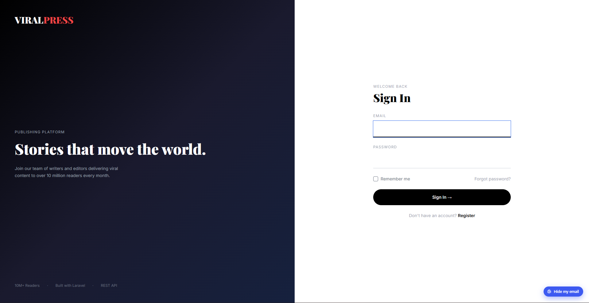
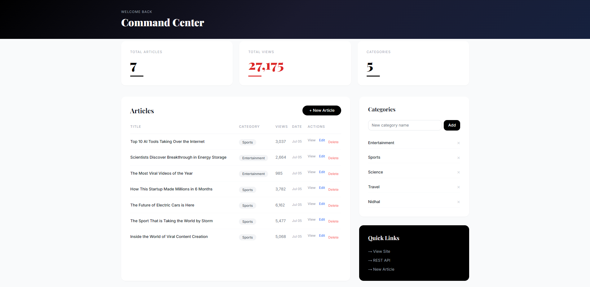
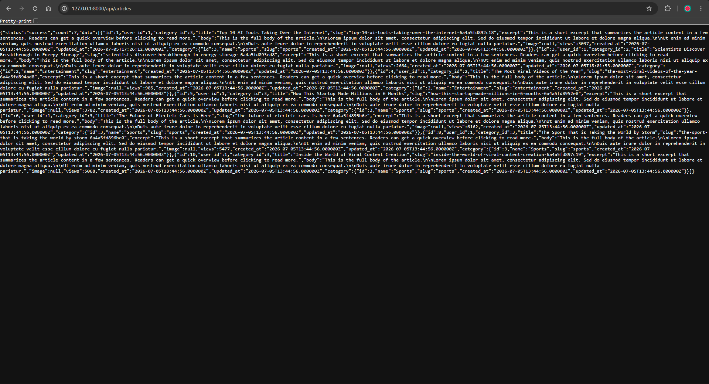

# ⚡ ViralPress — Laravel Publishing Platform
> A full-stack viral content publishing platform built with PHP/Laravel, MySQL, and Tailwind CSS. Designed to handle millions of readers with a clean editorial interface, admin dashboard, and REST API.


## 🚀 Live Features
### 📰 Public Frontend
- Editorial homepage with hero featured article
- Article grid with category filtering and pagination
- Full article pages with view counter, reading time, and related articles
- Live search across titles and excerpts
- Fully responsive — mobile, tablet, desktop

### 🔐 Authentication
- Multi-role system: Admin vs Reader
- Custom-designed login and register pages
- Laravel Breeze authentication

### ⚙️ Admin Dashboard
- KPI stats: total articles, total views, categories
- Full article management — create, edit, delete
- Category management
- Clean command center interface

### 📄 Article Pages
- Dynamic slug-based routing
- Auto view counter on every visit
- Related articles by category
- Author box and share functionality
- Estimated reading time

### 📡 REST API
- `GET /api/articles` — returns latest 20 articles with category data in JSON
- Ready for third-party integrations and mobile apps


## 🛠 Tech Stack
LayerTechnologyBackendPHP 8, Laravel 11FrontendBlade Templates, Tailwind CSS, JavaScriptDatabaseMySQLAuthenticationLaravel BreezeAPIREST JSONBuild ToolsVite, NPMVersion ControlGit / GitHub

## ⚙️ Installation
```bash
git clone https://github.com/sanaanidhal/viralpress.git
cd viralpress
composer install
npm install
cp .env.example .env
php artisan key:generate
```
Configure your database in `.env`:
```env
DB_CONNECTION=mysql
DB_DATABASE=viralpress
DB_USERNAME=root
DB_PASSWORD=your_password
```
Then run:
```bash
php artisan migrate --seed
php artisan serve
npm run dev
```

## 🔑 Demo Credentials
RoleEmailPasswordAdminadmin@viralpress.compassword

## 📡 API Reference
### Get all articles
```
GET /api/articles
```
**Response:**
```json
{
"status": "success",
"count": 10,
"data": [
{
"id": 1,
"title": "Top 10 AI Tools Taking Over the Internet",
"slug": "top-10-ai-tools-...",
"excerpt": "...",
"views": 2663,
"category": {
"id": 1,
"name": "Technology"
}
}
]
}
```

## 🏗 Architecture
```
viralpress/
├── app/
│   ├── Http/Controllers/
│   │   ├── ArticleController.php   # CRUD + API + search
│   │   ├── AdminController.php     # Dashboard + categories
│   │   └── ProfileController.php
│   └── Models/
│       ├── Article.php             # belongsTo Category, User
│       └── Category.php            # hasMany Articles
├── resources/views/
│   ├── layouts/app.blade.php       # Main layout
│   ├── articles/
│   │   ├── index.blade.php         # Homepage + search + category
│   │   └── show.blade.php          # Single article
│   ├── admin/
│   │   ├── dashboard.blade.php     # Admin command center
│   │   └── articles/
│   │       ├── create.blade.php
│   │       └── edit.blade.php
│   └── auth/                       # Custom login + register
├── routes/
│   └── web.php                     # All routes incl. API
└── database/
├── migrations/                 # Articles + Categories
└── seeders/                    # Demo data
```

## ✨ Key Implementation Details
- **Eager loading** — all queries use `with('category', 'user')` to prevent N+1 problems
- **Auto slugs** — generated with `Str::slug()` + `uniqid()` for uniqueness
- **View tracking** — incremented atomically with `->increment('views')`
- **Validation** — server-side validation on all forms with error display
- **CSRF protection** — all POST/PUT/DELETE forms protected
- **Route model binding** — clean controller methods using implicit binding

## 👨‍💻 Author
**Sanaa Mohamed Nidhal**
MSc Computer Science — University of Passau, Germany
[\]\(https://github.com/sanaanidhal\)
[\]\(https://linkedin.com/in/sanaa-nidhal\)